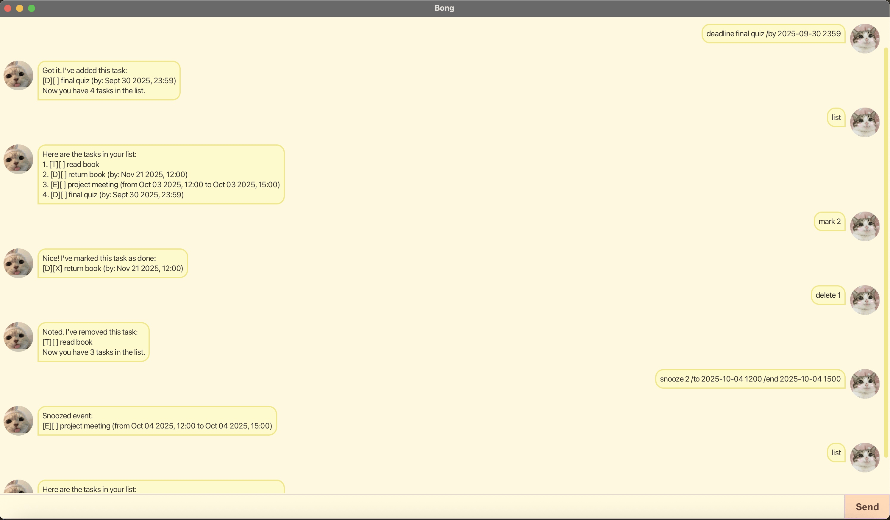

# Bong User Guide

 

Bong is a small task-management chatbot with a simple JavaFX GUI.  
You can add Todos, Deadlines and Events; list, mark/unmark, delete, find, and snooze (reschedule) tasks. Tasks are saved automatically to disk.

---

## Adding todos

Add a simple task without a date/time.

Format:
`todo DESCRIPTION`

Example:
```
todo read book
```

Expected output:
```
Got it. I've added this task:
[T][ ] read book
Now you have 1 tasks in the list.
```

---

## Adding deadlines

Add a task that has a due date and time.

Format:
`deadline DESCRIPTION /by yyyy-MM-dd HHmm`

Notes:
- DATE/TIME format is exactly `yyyy-MM-dd HHmm` (e.g., `2025-10-30 1200`).
- DESCRIPTION is any text describing the task.
- If the description or date/time is missing or badly formatted, Bong will show an error message.

Example:
```
deadline return book /by 2025-10-30 1200
```

Expected output:
```
Got it. I've added this task:
[D][ ] return book (by: Oct 30 2025, 12:00)
Now you have 2 tasks in the list.
```

---

## Adding events

Add a task that has a start and end time.

Format:
`event DESCRIPTION /from yyyy-MM-dd HHmm /to yyyy-MM-dd HHmm`

Example:
```
event project meeting /from 2025-09-30 1200 /to 2025-09-30 1500
```

Expected output:
```
Got it. I've added this task:
[E][ ] project meeting (from Sept 30 2025, 12:00 to Sept 30 2025, 15:00)
Now you have 3 tasks in the list.
```

---

## Listing tasks

Show all tasks currently stored.

Format:
`list`

Expected output (example):
```
    Here are the tasks in your list:
    1. [T][ ] read book
    2. [D][ ] return book (by: Oct 30 2025, 12:00)
    3. [E][ ] project meeting (from Sept 30 2025, 12:00 to Sept 30 2025, 15:00)
```

---

## Mark / Unmark tasks

Mark a task as done:

Format:
`mark TASK_INDEX`

Unmark a task (mark as not done):

Format:
`unmark TASK_INDEX`

Example:
```
mark 2
```

Expected output:
```
Nice! I've marked this task as done:
[D][X] return book (by: Oct 30 2025, 12:00)
```

---

## Deleting tasks

Remove a task from the list.

Format:
`delete TASK_INDEX`

Example:
```
delete 1
```

Expected output:
```
Noted. I've removed this task:
[T][ ] read book
Now you have 2 tasks in the list.
```

---

## Finding tasks

Search for tasks whose description contains a keyword.

Format:
`find KEYWORD`

Example:
```
find book
```

Expected output:
```
Here are the matching tasks in your list:
1. [D][X] return book (by: Oct 30 2025, 12:00)
```

---

## Snooze / Reschedule tasks

Reschedule a Deadline or an Event.

Reschedule a Deadline:

`snooze TASK_INDEX /to yyyy-MM-dd HHmm`


Reschedule an Event (both start and end required):

`snooze TASK_INDEX /to yyyy-MM-dd HHmm /end yyyy-MM-dd HHmm`

Examples:
```
snooze 1 /to 2025-10-31 1200
snooze 2 /to 2025-10-01 0900 /end 2025-10-01 1200
```

Expected output (deadline example):
```
Snoozed deadline:
[D][X] return book (by: Oct 31 2025, 12:00)
```

Notes:
- Only Deadlines and Events may be snoozed. Attempting to snooze a Todo will produce an error.

---

## Help

Show a summary of all supported commands and their formats.

Format:
`help`

Expected behavior:
- Displays a multi-line help message listing all available commands and formats (same as this guide).

---

## Exiting

Exit the application.

Format:
`bye`

Expected output:
```
Bye, hope to see you again soon!
```

---

## GUI usage

- Type your command in the text field at the bottom and press **Send** or Enter.
- User messages appear on the right; Bong responses appear on the left.
- Use the `help` command in the GUI to get the commands list.
- If user avatar or Bong avatar does not show, ensure `src/main/resources/images/` contains the images and that your run configuration working directory is the project root.

---

## Data & Storage

- Tasks are saved automatically to `data/bong.txt`.
- File format (each line a task):
  - Todo:
    ```
    T | 0 | DESCRIPTION
    ```
  - Deadline:
    ```
    D | 0 | DESCRIPTION | yyyy-MM-dd HHmm
    ```
  - Event:
    ```
    E | 0 | DESCRIPTION | yyyy-MM-dd HHmm | yyyy-MM-dd HHmm
    ```
  - The second field is `0` (not done) or `1` (done).

- Do not manually edit the file unless you know the format — malformed lines are skipped and a warning is shown at startup.
